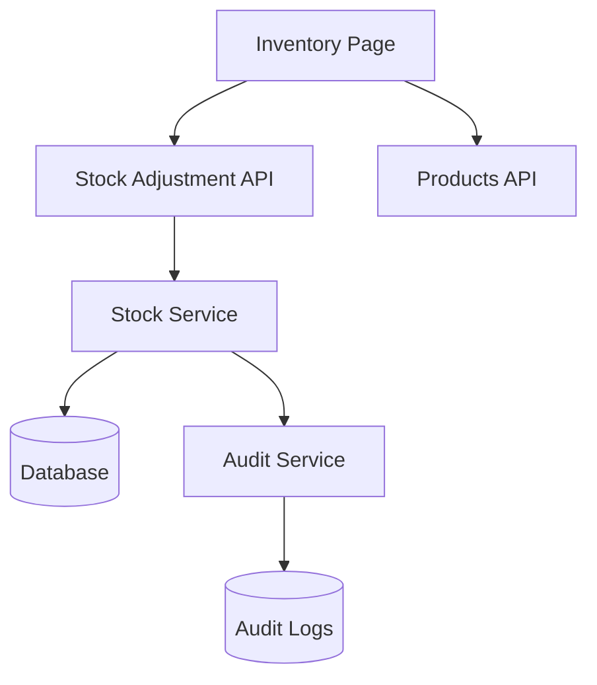
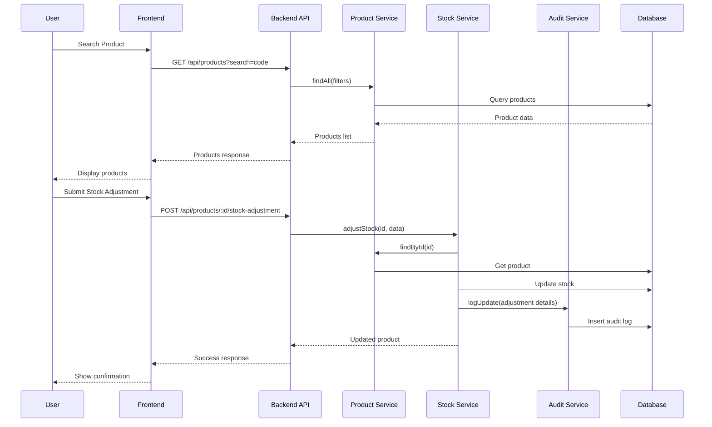

# Design Document

## Overview

Esta implementação integrará a página de controle de estoque do frontend com o backend, criando uma solução completa para gerenciamento de estoque com rastreabilidade e auditoria. O design aproveita a infraestrutura existente de produtos e auditoria, adicionando novos endpoints e funcionalidades específicas para ajustes de estoque.

## Architecture

### High-Level Architecture



### Component Interaction Flow



## Components and Interfaces

### Backend Components

#### 1. Stock Adjustment Controller
**File:** `server/src/controllers/stock-adjustment.controller.ts`

```typescript
interface StockAdjustmentController {
  adjustStock(request: FastifyRequest, reply: FastifyReply): Promise<void>
  getStockHistory(request: FastifyRequest, reply: FastifyReply): Promise<void>
}
```

#### 2. Stock Adjustment Service
**File:** `server/src/services/stock-adjustment.service.ts`

```typescript
interface StockAdjustmentService {
  adjustStock(productId: string, data: StockAdjustmentData): Promise<Product>
  getAdjustmentHistory(filters: StockHistoryFilters): Promise<StockAdjustment[]>
}
```

#### 3. Enhanced Product Service
**Existing file:** `server/src/services/products.service.ts`
- Utilizar métodos existentes `adjustStock()` e `findById()`
- Adicionar método para busca otimizada por código

### Frontend Components

#### 1. Enhanced Inventory Service
**File:** `flow-crm/src/services/inventoryService.ts`

```typescript
interface InventoryService {
  searchProducts(query: string): Promise<Product[]>
  adjustStock(productId: string, adjustment: StockAdjustmentRequest): Promise<Product>
  getStockHistory(filters?: StockHistoryFilters): Promise<StockAdjustment[]>
}
```

#### 2. Updated Inventory Page
**Existing file:** `flow-crm/src/components/features/inventory/InventoryPage.tsx`
- Remover dados mockados
- Integrar com inventoryService
- Adicionar estados de loading e error

## Data Models

### Stock Adjustment Request
```typescript
interface StockAdjustmentRequest {
  adjustmentType: 'add' | 'remove'
  quantity: number
  reason: string
  userId?: string // Para auditoria
}
```

### Stock Adjustment Response
```typescript
interface StockAdjustment {
  id: string
  productId: string
  productCode: string
  productName: string
  adjustmentType: 'add' | 'remove'
  quantity: number
  previousStock: number
  newStock: number
  reason: string
  userId: string
  userName: string
  createdAt: Date
}
```

### Stock History Filters
```typescript
interface StockHistoryFilters {
  productId?: string
  productCode?: string
  adjustmentType?: 'add' | 'remove'
  startDate?: Date
  endDate?: Date
  userId?: string
  page?: number
  limit?: number
}
```

## API Endpoints

### 1. Stock Adjustment Endpoint
```
POST /api/products/:id/stock-adjustment
```

**Request Body:**
```json
{
  "adjustmentType": "add|remove",
  "quantity": 10,
  "reason": "Compra de mercadoria"
}
```

**Response:**
```json
{
  "success": true,
  "data": {
    "id": "product-id",
    "code": "PRD001",
    "name": "Product Name",
    "stock": 110,
    "previousStock": 100
  },
  "message": "Stock adjusted successfully"
}
```

### 2. Stock History Endpoint
```
GET /api/stock-adjustments
```

**Query Parameters:**
- `productId` (optional)
- `productCode` (optional)
- `adjustmentType` (optional)
- `startDate` (optional)
- `endDate` (optional)
- `page` (optional, default: 1)
- `limit` (optional, default: 50)

**Response:**
```json
{
  "success": true,
  "data": [
    {
      "id": "adj-id",
      "productId": "product-id",
      "productCode": "PRD001",
      "productName": "Product Name",
      "adjustmentType": "add",
      "quantity": 10,
      "previousStock": 100,
      "newStock": 110,
      "reason": "Compra de mercadoria",
      "userName": "User Name",
      "createdAt": "2024-01-15T10:00:00Z"
    }
  ],
  "pagination": {
    "page": 1,
    "limit": 50,
    "total": 1,
    "totalPages": 1
  }
}
```

### 3. Enhanced Product Search
```
GET /api/products?search=:query&limit=10
```
- Utilizar endpoint existente com otimizações para busca rápida

## Error Handling

### Backend Error Scenarios
1. **Product Not Found** (404)
   - Produto não existe
   - Retornar erro específico

2. **Insufficient Stock** (400)
   - Tentativa de remover mais estoque do que disponível
   - Validação antes da operação

3. **Invalid Adjustment Data** (400)
   - Quantidade negativa ou zero
   - Motivo vazio ou muito longo

4. **Database Transaction Failure** (500)
   - Falha na atualização do estoque
   - Rollback automático

### Frontend Error Handling
1. **Network Errors**
   - Timeout de requisição
   - Conexão perdida
   - Retry automático com backoff

2. **Validation Errors**
   - Campos obrigatórios
   - Formato de dados inválido
   - Feedback visual imediato

3. **Business Logic Errors**
   - Estoque insuficiente
   - Produto não encontrado
   - Mensagens de erro específicas

## Testing Strategy

### Backend Testing
1. **Unit Tests**
   - Stock adjustment service methods
   - Validation logic
   - Error scenarios

2. **Integration Tests**
   - API endpoints
   - Database transactions
   - Audit log creation

3. **Edge Cases**
   - Concurrent stock adjustments
   - Large quantity adjustments
   - Invalid product IDs

### Frontend Testing
1. **Component Tests**
   - Form validation
   - Product search functionality
   - Error state handling

2. **Integration Tests**
   - API communication
   - State management
   - User workflows

3. **E2E Tests**
   - Complete stock adjustment flow
   - History viewing
   - Error scenarios

## Security Considerations

### Authentication & Authorization
- Verificar token JWT em todas as requisições
- Validar permissões de usuário para ajustes de estoque
- Registrar usuário responsável por cada ajuste

### Data Validation
- Sanitizar inputs do usuário
- Validar tipos de dados
- Limitar tamanho de campos de texto

### Audit Trail
- Registrar todas as operações de estoque
- Incluir IP e User-Agent
- Manter logs imutáveis

## Performance Considerations

### Database Optimization
- Índices em campos de busca frequente
- Paginação para histórico de ajustes
- Transações otimizadas

### Frontend Optimization
- Debounce em busca de produtos
- Cache de produtos recentemente buscados
- Loading states para melhor UX

### API Optimization
- Compressão de responses
- Rate limiting
- Caching de produtos frequentemente acessados