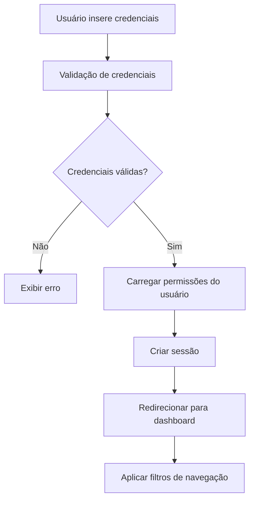
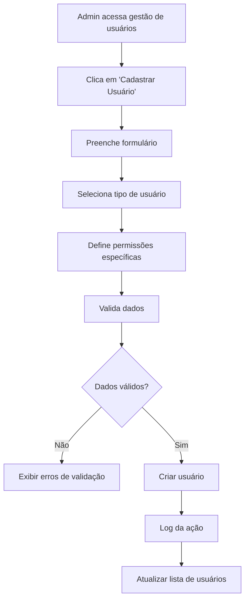
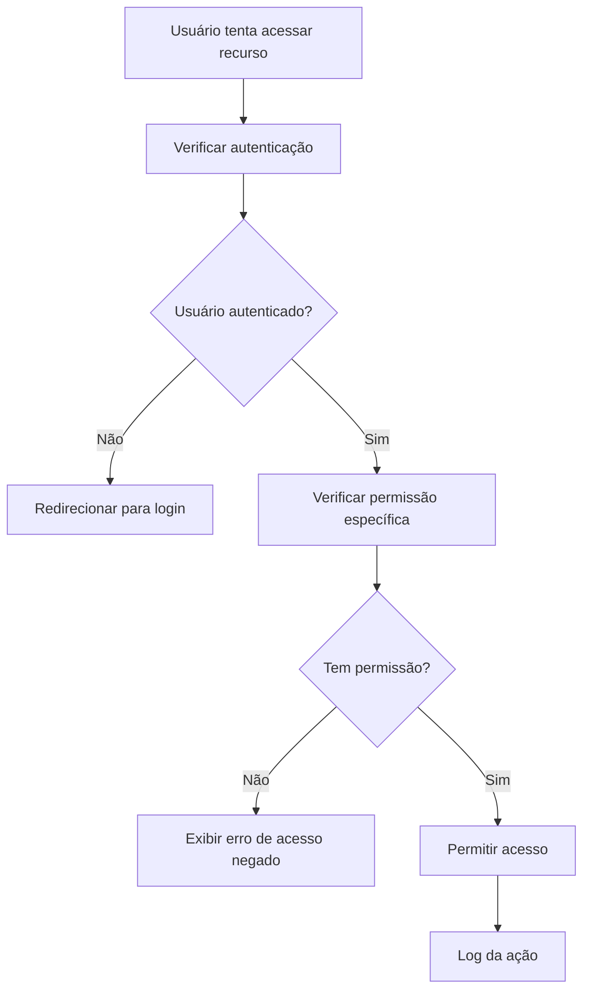

# Documento de Design - Sistema de Usuários e Níveis de Acesso

## Visão Geral

O sistema de usuários e níveis de acesso será implementado como uma extensão da arquitetura de autenticação existente no Flow CRM. O design aproveitará os componentes e padrões já estabelecidos, integrando-se perfeitamente com a estrutura atual do projeto.

## Arquitetura

### Estrutura de Dados

#### Tipos de Usuário Expandidos
```typescript
export interface User extends BaseEntity {
  name: string;
  email: string;
  password: string; // Hash da senha
  userType: 'admin' | 'employee';
  permissions: UserPermissions;
  isActive: boolean;
  lastLoginAt?: Date;
  createdBy?: string; // ID do administrador que criou
}

export interface UserPermissions {
  modules: {
    products: boolean;
    customers: boolean;
    reports: boolean;
    paymentMethods: boolean; // Apenas para admins
    userManagement: boolean; // Apenas para admins
  };
  presales: {
    canCreate: boolean;
    canViewOwn: boolean;
    canViewAll: boolean; // Apenas para admins
  };
}

export interface UserSession {
  userId: string;
  userType: 'admin' | 'employee';
  permissions: UserPermissions;
  loginTime: Date;
  lastActivity: Date;
}
```

#### Logs de Auditoria
```typescript
export interface AuditLog extends BaseEntity {
  userId: string;
  userName: string;
  action: 'login' | 'logout' | 'create' | 'update' | 'delete' | 'view';
  resource: string; // 'user', 'product', 'customer', etc.
  resourceId?: string;
  details?: string;
  ipAddress?: string;
  userAgent?: string;
}
```

### Componentes e Interfaces

#### 1. Serviço de Autenticação Expandido

**Localização:** `src/services/authService.ts`

Extensão do `mockAuthService` existente para suportar:
- Múltiplos usuários com diferentes tipos
- Validação de permissões
- Gestão de sessões
- Logs de auditoria

```typescript
export interface AuthService {
  // Métodos existentes
  login(credentials: UserCredentials): Promise<AuthUser>;
  logout(): void;
  getStoredUser(): AuthUser | null;
  isAuthenticated(): boolean;
  
  // Novos métodos
  hasPermission(permission: string): boolean;
  getUserPermissions(): UserPermissions;
  logActivity(action: string, resource: string, details?: string): void;
}
```

#### 2. Serviço de Gestão de Usuários

**Localização:** `src/services/userManagementService.ts`

```typescript
export interface UserManagementService {
  getAllUsers(): Promise<User[]>;
  createUser(userData: CreateUserRequest): Promise<User>;
  updateUser(userId: string, userData: UpdateUserRequest): Promise<User>;
  deleteUser(userId: string): Promise<void>;
  updateUserPermissions(userId: string, permissions: UserPermissions): Promise<void>;
  getAuditLogs(filters?: AuditLogFilters): Promise<AuditLog[]>;
}
```

#### 3. Hook de Permissões

**Localização:** `src/hooks/usePermissions.ts`

```typescript
export interface UsePermissions {
  hasPermission: (permission: string) => boolean;
  canAccessModule: (module: string) => boolean;
  isAdmin: () => boolean;
  isEmployee: () => boolean;
  permissions: UserPermissions;
}
```

#### 4. Componente de Proteção de Rotas

**Localização:** `src/components/common/ProtectedRoute/ProtectedRoute.tsx`

```typescript
interface ProtectedRouteProps {
  children: React.ReactNode;
  requiredPermission?: string;
  requiredUserType?: 'admin' | 'employee';
  fallback?: React.ReactNode;
}
```

#### 5. Página de Gestão de Usuários

**Localização:** `src/components/features/users/`

Estrutura seguindo o padrão existente:
- `UsersPage.tsx` - Componente principal com abas
- `UsersList.tsx` - Aba de listagem
- `UserForm.tsx` - Aba de cadastro/edição
- `PermissionsEditor.tsx` - Editor de permissões
- `AuditLogViewer.tsx` - Visualizador de logs

### Modelos de Dados

#### Usuários Padrão do Sistema
```typescript
const DEFAULT_USERS = [
  {
    id: '1',
    name: 'Administrador',
    email: 'admin@flowcrm.com',
    userType: 'admin',
    permissions: {
      modules: {
        products: true,
        customers: true,
        reports: true,
        paymentMethods: true,
        userManagement: true,
      },
      presales: {
        canCreate: true,
        canViewOwn: true,
        canViewAll: true,
      },
    },
  },
  // Usuários funcionários serão criados dinamicamente
];
```

#### Permissões Padrão por Tipo
```typescript
const DEFAULT_PERMISSIONS = {
  admin: {
    modules: {
      products: true,
      customers: true,
      reports: true,
      paymentMethods: true,
      userManagement: true,
    },
    presales: {
      canCreate: true,
      canViewOwn: true,
      canViewAll: true,
    },
  },
  employee: {
    modules: {
      products: true,
      customers: true,
      reports: false,
      paymentMethods: false,
      userManagement: false,
    },
    presales: {
      canCreate: true,
      canViewOwn: true,
      canViewAll: false,
    },
  },
};
```

## Tratamento de Erros

### Tipos de Erro
```typescript
export interface UserManagementError extends Error {
  code: 'PERMISSION_DENIED' | 'USER_NOT_FOUND' | 'EMAIL_EXISTS' | 'INVALID_DATA';
  details?: string;
}
```

### Estratégias de Tratamento
1. **Acesso Negado:** Redirecionamento para página de erro ou dashboard
2. **Sessão Expirada:** Logout automático e redirecionamento para login
3. **Dados Inválidos:** Validação no frontend com mensagens claras
4. **Conflitos:** Mensagens específicas (ex: email já existe)

## Estratégia de Testes

### Testes Unitários
- Serviços de autenticação e gestão de usuários
- Hooks de permissões
- Componentes de formulário
- Validações de dados

### Testes de Integração
- Fluxo completo de login/logout
- Criação e edição de usuários
- Aplicação de permissões
- Navegação baseada em permissões

### Testes de Componentes
- Renderização condicional baseada em permissões
- Formulários de usuário
- Tabelas de listagem
- Modais de confirmação

## Integração com Sistema Existente

### 1. Extensão do AuthContext
O `AuthContext` existente será expandido para incluir informações de permissões:

```typescript
export interface AuthContextType {
  // Propriedades existentes
  user: AuthUser | null;
  isAuthenticated: boolean;
  isLoading: boolean;
  error: AuthError | null;
  login: (credentials: UserCredentials) => Promise<void>;
  logout: () => void;
  clearError: () => void;
  
  // Novas propriedades
  permissions: UserPermissions;
  hasPermission: (permission: string) => boolean;
  isAdmin: boolean;
  isEmployee: boolean;
}
```

### 2. Atualização do Sidebar
O componente `Sidebar` será modificado para:
- Mostrar/ocultar itens baseado em permissões
- Adicionar "Usuários" no menu "Cadastros" apenas para admins
- Aplicar filtros de navegação dinamicamente

### 3. Modificação das Páginas Existentes
- **Dashboard:** Métricas filtradas por permissões
- **Pré-vendas:** Filtros baseados no tipo de usuário
- **Relatórios:** Acesso condicional baseado em permissões

### 4. Estrutura de Rotas Atualizada
```typescript
// src/routes/AppRoutes.tsx
const routes = [
  // Rotas existentes
  { path: '/dashboard', component: Dashboard },
  { path: '/presales', component: PresalesPage },
  
  // Nova rota protegida
  { 
    path: '/users', 
    component: UsersPage, 
    requiredPermission: 'userManagement',
    requiredUserType: 'admin'
  },
];
```

## Considerações de Segurança

### 1. Validação de Permissões
- Verificação no frontend E backend (quando implementado)
- Validação em cada ação sensível
- Logs de tentativas de acesso não autorizado

### 2. Gestão de Sessões
- Timeout automático de sessão
- Invalidação de sessão em mudanças de permissão
- Controle de sessões simultâneas

### 3. Auditoria
- Log de todas as ações administrativas
- Rastreamento de mudanças de permissões
- Histórico de acessos por usuário

## Fluxos de Trabalho

### 1. Fluxo de Login


### 2. Fluxo de Criação de Usuário


### 3. Fluxo de Verificação de Permissões


## Implementação Responsiva

### Desktop
- Sidebar com menu completo
- Tabelas com todas as colunas
- Modais de tamanho padrão

### Tablet
- Sidebar colapsível
- Tabelas com colunas essenciais
- Modais adaptados

### Mobile
- Menu hambúrguer
- Cards em vez de tabelas
- Modais em tela cheia

## Acessibilidade

### Conformidade WCAG 2.1
- Navegação por teclado
- Leitores de tela
- Contraste adequado
- Labels descritivos

### Recursos Específicos
- Indicadores visuais de permissões
- Mensagens de erro claras
- Feedback de ações realizadas
- Atalhos de teclado para ações comuns