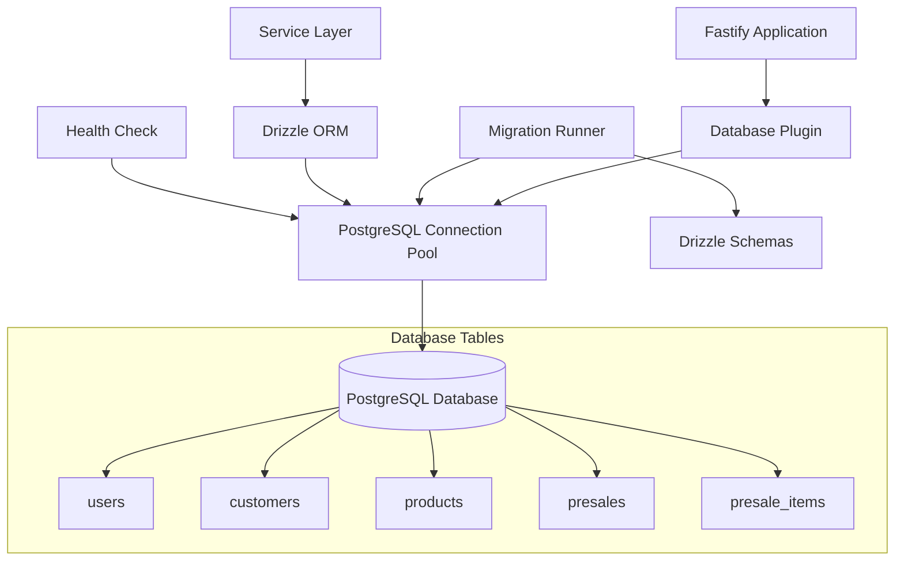
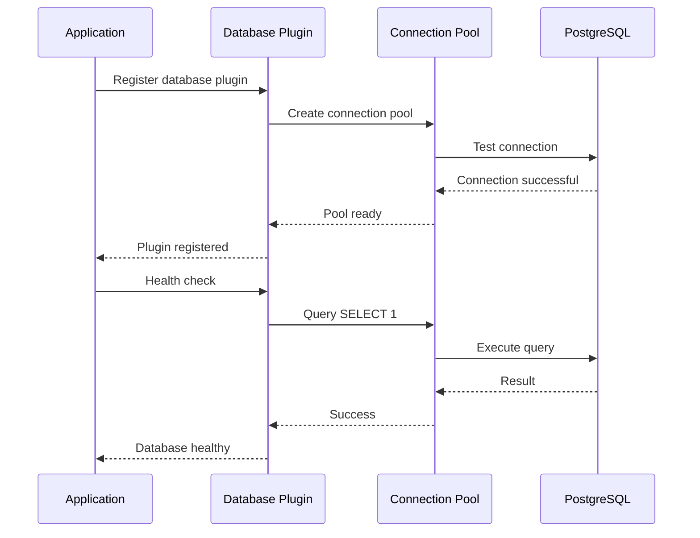

# Design Document

## Overview

The Database Integration design focuses on establishing a robust connection between the Flow CRM Backend and PostgreSQL database. The system already has comprehensive Drizzle ORM schemas, service layer implementations, and database configuration in place. This design addresses the final integration steps: executing migrations, establishing live database connections, updating the database plugin, and ensuring all services operate with persistent data storage instead of mock data.

## Architecture

### Database Integration Architecture



### Connection Flow



## Components and Interfaces

### Migration System

#### Migration Runner
```typescript
interface MigrationRunner {
  runMigrations(): Promise<void>;
  checkMigrationStatus(): Promise<MigrationStatus>;
  rollbackMigration(steps?: number): Promise<void>;
}

interface MigrationStatus {
  applied: string[];
  pending: string[];
  lastApplied?: string;
}
```

#### Migration Configuration
- **Location**: `./drizzle` directory contains generated migration files
- **Schema Source**: `./src/db/schema/*` - All schema definitions
- **Generation**: `drizzle-kit generate` creates migration files from schema changes
- **Execution**: Custom migration runner using Drizzle's migrate function

### Database Connection Management

#### Connection Pool Configuration
```typescript
interface DatabaseConfig {
  connectionString: string;
  ssl: boolean | { rejectUnauthorized: boolean };
  max: number;                    // Maximum connections (20)
  idleTimeoutMillis: number;      // Idle timeout (30s)
  connectionTimeoutMillis: number; // Connection timeout (2s)
}
```

#### Database Plugin Interface
```typescript
interface DatabasePlugin {
  register(fastify: FastifyInstance): Promise<void>;
  checkHealth(): Promise<HealthStatus>;
  getConnection(): DrizzleDatabase;
  close(): Promise<void>;
}

interface HealthStatus {
  status: 'healthy' | 'unhealthy';
  message: string;
  timestamp: Date;
  connectionCount?: number;
}
```

### Service Integration

#### Database Service Access
All existing services (CustomerService, ProductService, PreSalesService, AuthService) are already implemented to use Drizzle ORM with the database connection. No changes needed to service interfaces.

#### Connection Injection
```typescript
// Services import the database connection directly
import { db } from '../db/connection';

// All database operations use the shared connection pool
const result = await db.select().from(customers);
```

## Data Models

### Database Schema Structure

The database schema is already fully defined with the following tables:

#### Users Table
```sql
CREATE TABLE users (
  id UUID PRIMARY KEY DEFAULT gen_random_uuid(),
  email VARCHAR(255) NOT NULL UNIQUE,
  password VARCHAR(255) NOT NULL,
  name VARCHAR(255) NOT NULL,
  role user_role NOT NULL,
  created_at TIMESTAMP DEFAULT NOW() NOT NULL,
  updated_at TIMESTAMP DEFAULT NOW() NOT NULL
);

CREATE TYPE user_role AS ENUM ('admin', 'manager', 'employee');
```

#### Customers Table
```sql
CREATE TABLE customers (
  id UUID PRIMARY KEY DEFAULT gen_random_uuid(),
  name VARCHAR(255) NOT NULL,
  email VARCHAR(255) NOT NULL,
  phone VARCHAR(20) NOT NULL,
  cpf VARCHAR(14) NOT NULL UNIQUE,
  address TEXT,
  created_at TIMESTAMP DEFAULT NOW() NOT NULL,
  updated_at TIMESTAMP DEFAULT NOW() NOT NULL
);
```

#### Products Table
```sql
CREATE TABLE products (
  id UUID PRIMARY KEY DEFAULT gen_random_uuid(),
  code VARCHAR(50) NOT NULL UNIQUE,
  name VARCHAR(255) NOT NULL,
  unit VARCHAR(20) NOT NULL,
  description TEXT,
  stock INTEGER DEFAULT 0 NOT NULL,
  purchase_price DECIMAL(10,2) NOT NULL,
  sale_price DECIMAL(10,2) NOT NULL,
  sale_type VARCHAR(50) NOT NULL,
  created_at TIMESTAMP DEFAULT NOW() NOT NULL,
  updated_at TIMESTAMP DEFAULT NOW() NOT NULL
);
```

#### PreSales and PreSaleItems Tables
```sql
CREATE TABLE presales (
  id UUID PRIMARY KEY DEFAULT gen_random_uuid(),
  customer_id UUID REFERENCES customers(id) NOT NULL,
  status presale_status NOT NULL,
  total DECIMAL(10,2) NOT NULL,
  discount DECIMAL(10,2) DEFAULT 0 NOT NULL,
  notes TEXT,
  created_at TIMESTAMP DEFAULT NOW() NOT NULL,
  updated_at TIMESTAMP DEFAULT NOW() NOT NULL
);

CREATE TYPE presale_status AS ENUM ('draft', 'pending', 'approved', 'cancelled', 'converted');

CREATE TABLE presale_items (
  id UUID PRIMARY KEY DEFAULT gen_random_uuid(),
  presale_id UUID REFERENCES presales(id) ON DELETE CASCADE NOT NULL,
  product_id UUID REFERENCES products(id) NOT NULL,
  quantity DECIMAL(10,3) NOT NULL,
  unit_price DECIMAL(10,2) NOT NULL,
  total_price DECIMAL(10,2) NOT NULL,
  discount DECIMAL(10,2) DEFAULT 0 NOT NULL
);
```

### Migration Files Structure

Drizzle Kit generates migration files in the following format:
```
drizzle/
├── meta/
│   └── _journal.json          # Migration history
├── 0000_initial_schema.sql    # Initial table creation
├── 0001_add_indexes.sql       # Performance indexes
└── 0002_constraints.sql       # Additional constraints
```

## Error Handling

### Database Connection Errors

#### Connection Failure Handling
```typescript
interface DatabaseError {
  code: string;
  message: string;
  detail?: string;
  hint?: string;
}

// Common PostgreSQL error codes
const ERROR_CODES = {
  CONNECTION_FAILURE: '08006',
  UNIQUE_VIOLATION: '23505',
  FOREIGN_KEY_VIOLATION: '23503',
  NOT_NULL_VIOLATION: '23502',
  CHECK_VIOLATION: '23514'
} as const;
```

#### Error Recovery Strategies
1. **Connection Pool Exhaustion**: Implement connection retry with exponential backoff
2. **Network Timeouts**: Configure appropriate timeout values and retry logic
3. **Constraint Violations**: Map database errors to user-friendly messages
4. **Migration Failures**: Provide rollback capabilities and detailed error reporting

### Health Check Implementation

#### Database Health Monitoring
```typescript
interface HealthCheck {
  performHealthCheck(): Promise<HealthResult>;
  getConnectionStats(): ConnectionStats;
  testQuery(): Promise<boolean>;
}

interface HealthResult {
  database: {
    status: 'up' | 'down';
    responseTime: number;
    connections: {
      active: number;
      idle: number;
      total: number;
    };
  };
}
```

## Testing Strategy

### Migration Testing
- **Unit Tests**: Test migration runner logic and error handling
- **Integration Tests**: Test migrations against test database instances
- **Rollback Tests**: Verify migration rollback functionality works correctly

### Connection Testing
- **Connection Pool Tests**: Verify pool creation, connection limits, and cleanup
- **Health Check Tests**: Test database health monitoring and error detection
- **Service Integration Tests**: Verify all services work with real database connections

### Database Operation Testing
- **CRUD Operations**: Test all create, read, update, delete operations with real data
- **Constraint Testing**: Verify database constraints are properly enforced
- **Transaction Testing**: Test transaction handling and rollback scenarios

### Test Database Setup
```typescript
// Test database configuration
const testDatabaseConfig = {
  connectionString: process.env.TEST_DATABASE_URL,
  // Isolated test database instance
  // Automatic cleanup between tests
  // Seeded with test data
};
```

The testing strategy ensures that database integration works correctly across all scenarios while maintaining data integrity and performance standards.