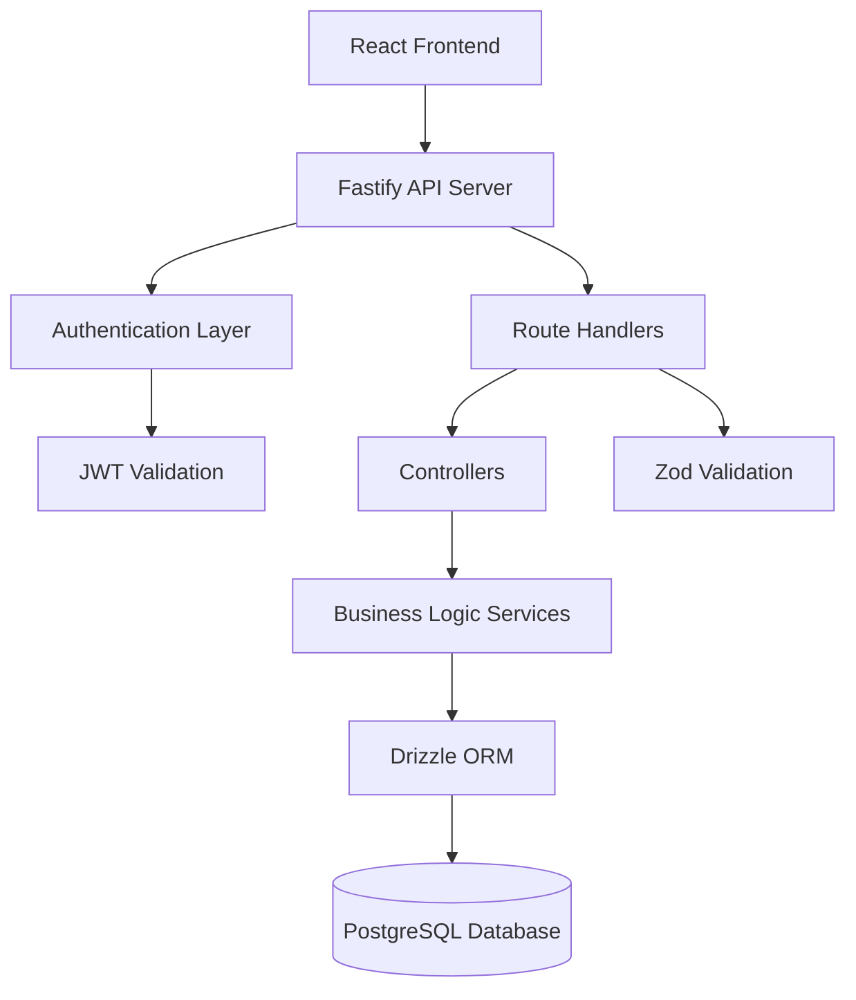

# Design Document

## Overview

The Flow CRM Backend is designed as a RESTful API using a layered architecture pattern with clear separation of concerns. The system leverages Fastify for high-performance HTTP handling, Drizzle ORM for type-safe database operations, and implements JWT-based authentication with role-based access control. The architecture follows modern Node.js best practices with TypeScript for type safety and maintainability.

## Architecture

### High-Level Architecture



### Layered Architecture

1. **Presentation Layer**: Fastify routes and controllers handling HTTP requests/responses
2. **Business Logic Layer**: Services containing domain logic and business rules
3. **Data Access Layer**: Drizzle ORM providing type-safe database operations
4. **Database Layer**: PostgreSQL with optimized schemas and indexes

### Project Structure

```
flow-crm-backend/
├── src/
│   ├── config/
│   │   ├── database.ts          # Database connection configuration
│   │   ├── environment.ts       # Environment variables validation
│   │   └── jwt.ts              # JWT configuration
│   ├── db/
│   │   ├── connection.ts        # Database connection setup
│   │   ├── migrate.ts          # Migration runner
│   │   └── schema/             # Drizzle schema definitions
│   │       ├── users.ts
│   │       ├── customers.ts
│   │       ├── products.ts
│   │       ├── presales.ts
│   │       └── index.ts
│   ├── routes/
│   │   ├── auth.ts             # Authentication routes
│   │   ├── customers.ts        # Customer CRUD routes
│   │   ├── products.ts         # Product CRUD routes
│   │   ├── presales.ts         # Pre-sales CRUD routes
│   │   └── index.ts            # Route registration
│   ├── controllers/
│   │   ├── auth.controller.ts
│   │   ├── customers.controller.ts
│   │   ├── products.controller.ts
│   │   └── presales.controller.ts
│   ├── services/
│   │   ├── auth.service.ts
│   │   ├── customers.service.ts
│   │   ├── products.service.ts
│   │   └── presales.service.ts
│   ├── schemas/
│   │   ├── auth.schemas.ts      # Zod validation schemas
│   │   ├── customers.schemas.ts
│   │   ├── products.schemas.ts
│   │   └── presales.schemas.ts
│   ├── utils/
│   │   ├── cpf-cnpj-validator.ts     # CPF-CNPJ validation utility
│   │   ├── password-hash.ts     # Password hashing utility
│   │   └── response-helpers.ts  # Standard response formatters
│   ├── plugins/
│   │   ├── auth.plugin.ts       # JWT authentication plugin
│   │   ├── database.plugin.ts   # Database connection plugin
│   │   └── cors.plugin.ts       # CORS configuration plugin
│   ├── types/
│   │   ├── auth.types.ts        # Authentication type definitions
│   │   └── common.types.ts      # Common type definitions
│   ├── app.ts                   # Fastify application setup
│   └── server.ts               # Application entry point
└── tests/                      # Test files mirroring src structure
```

## Components and Interfaces

### Database Schema Design

#### Users Table
```typescript
export const users = pgTable('users', {
  id: uuid('id').primaryKey().defaultRandom(),
  email: varchar('email', { length: 255 }).notNull().unique(),
  password: varchar('password', { length: 255 }).notNull(),
  name: varchar('name', { length: 255 }).notNull(),
  role: pgEnum('user_role', ['admin', 'manager', 'employee']).notNull(),
  createdAt: timestamp('created_at').defaultNow().notNull(),
  updatedAt: timestamp('updated_at').defaultNow().notNull()
});
```

#### Customers Table
```typescript
export const customers = pgTable('customers', {
  id: uuid('id').primaryKey().defaultRandom(),
  name: varchar('name', { length: 255 }).notNull(),
  email: varchar('email', { length: 255 }).notNull(),
  phone: varchar('phone', { length: 20 }).notNull(),
  cpf: varchar('cpf', { length: 14 }).notNull().unique(),
  address: text('address'),
  createdAt: timestamp('created_at').defaultNow().notNull(),
  updatedAt: timestamp('updated_at').defaultNow().notNull()
});
```

#### Products Table
```typescript
export const products = pgTable('products', {
  id: uuid('id').primaryKey().defaultRandom(),
  code: varchar('code', { length: 50 }).notNull().unique(),
  name: varchar('name', { length: 255 }).notNull(),
  unit: varchar('unit', { length: 20 }).notNull(),
  description: text('description'),
  stock: integer('stock').default(0).notNull(),
  purchasePrice: decimal('purchase_price', { precision: 10, scale: 2 }).notNull(),
  salePrice: decimal('sale_price', { precision: 10, scale: 2 }).notNull(),
  saleType: varchar('sale_type', { length: 50 }).notNull(),
  createdAt: timestamp('created_at').defaultNow().notNull(),
  updatedAt: timestamp('updated_at').defaultNow().notNull()
});
```

#### PreSales and PreSaleItems Tables
```typescript
export const preSales = pgTable('presales', {
  id: uuid('id').primaryKey().defaultRandom(),
  customerId: uuid('customer_id').references(() => customers.id).notNull(),
  status: pgEnum('presale_status', ['draft', 'pending', 'approved', 'cancelled', 'converted']).notNull(),
  total: decimal('total', { precision: 10, scale: 2 }).notNull(),
  discount: decimal('discount', { precision: 10, scale: 2 }).default('0').notNull(),
  notes: text('notes'),
  createdAt: timestamp('created_at').defaultNow().notNull(),
  updatedAt: timestamp('updated_at').defaultNow().notNull()
});

export const preSaleItems = pgTable('presale_items', {
  id: uuid('id').primaryKey().defaultRandom(),
  preSaleId: uuid('presale_id').references(() => preSales.id, { onDelete: 'cascade' }).notNull(),
  productId: uuid('product_id').references(() => products.id).notNull(),
  quantity: decimal('quantity', { precision: 10, scale: 3 }).notNull(),
  unitPrice: decimal('unit_price', { precision: 10, scale: 2 }).notNull(),
  totalPrice: decimal('total_price', { precision: 10, scale: 2 }).notNull(),
  discount: decimal('discount', { precision: 10, scale: 2 }).default('0').notNull()
});
```

### Service Layer Interfaces

#### Authentication Service
```typescript
interface AuthService {
  login(email: string, password: string): Promise<{ user: User; token: string }>;
  register(userData: CreateUserData): Promise<User>;
  validateToken(token: string): Promise<User>;
  hashPassword(password: string): Promise<string>;
  comparePassword(password: string, hash: string): Promise<boolean>;
}
```

#### Customer Service
```typescript
interface CustomerService {
  findAll(filters?: CustomerFilters): Promise<Customer[]>;
  findById(id: string): Promise<Customer | null>;
  create(customerData: CreateCustomerData): Promise<Customer>;
  update(id: string, customerData: UpdateCustomerData): Promise<Customer>;
  delete(id: string): Promise<void>;
  validateCpf(cpf: string): boolean;
}
```

#### Product Service
```typescript
interface ProductService {
  findAll(filters?: ProductFilters): Promise<Product[]>;
  findById(id: string): Promise<Product | null>;
  create(productData: CreateProductData): Promise<Product>;
  update(id: string, productData: UpdateProductData): Promise<Product>;
  delete(id: string): Promise<void>;
  updateStock(id: string, quantity: number): Promise<void>;
}
```

#### PreSales Service
```typescript
interface PreSalesService {
  findAll(filters?: PreSalesFilters): Promise<PreSale[]>;
  findById(id: string): Promise<PreSaleWithItems | null>;
  create(preSaleData: CreatePreSaleData): Promise<PreSaleWithItems>;
  update(id: string, preSaleData: UpdatePreSaleData): Promise<PreSaleWithItems>;
  delete(id: string): Promise<void>;
  updateStatus(id: string, status: PreSaleStatus): Promise<PreSale>;
  calculateTotals(items: PreSaleItem[]): { subtotal: number; total: number };
}
```

### API Route Structure

#### Authentication Routes
- `POST /api/auth/login` - User authentication
- `GET /api/auth/me` - Get current user profile
- `POST /api/auth/register` - Register new user (admin only)

#### Customer Routes
- `GET /api/customers` - List customers with optional filters
- `GET /api/customers/:id` - Get customer by ID
- `POST /api/customers` - Create new customer
- `PUT /api/customers/:id` - Update customer
- `DELETE /api/customers/:id` - Delete customer

#### Product Routes
- `GET /api/products` - List products with optional filters
- `GET /api/products/:id` - Get product by ID
- `POST /api/products` - Create new product
- `PUT /api/products/:id` - Update product
- `DELETE /api/products/:id` - Delete product

#### PreSales Routes
- `GET /api/presales` - List pre-sales with optional filters
- `GET /api/presales/:id` - Get pre-sale with items by ID
- `POST /api/presales` - Create new pre-sale
- `PUT /api/presales/:id` - Update pre-sale
- `DELETE /api/presales/:id` - Delete pre-sale
- `PUT /api/presales/:id/status` - Update pre-sale status

## Data Models

### Core Entity Models

```typescript
// User Model
interface User {
  id: string;
  email: string;
  name: string;
  role: 'admin' | 'manager' | 'employee';
  createdAt: Date;
  updatedAt: Date;
}

// Customer Model
interface Customer {
  id: string;
  name: string;
  email: string;
  phone: string;
  cpf: string;
  address?: string;
  createdAt: Date;
  updatedAt: Date;
}

// Product Model
interface Product {
  id: string;
  code: string;
  name: string;
  unit: string;
  description?: string;
  stock: number;
  purchasePrice: number;
  salePrice: number;
  saleType: string;
  createdAt: Date;
  updatedAt: Date;
}

// PreSale Model
interface PreSale {
  id: string;
  customerId: string;
  status: 'draft' | 'pending' | 'approved' | 'cancelled' | 'converted';
  total: number;
  discount: number;
  notes?: string;
  createdAt: Date;
  updatedAt: Date;
}

// PreSaleItem Model
interface PreSaleItem {
  id: string;
  preSaleId: string;
  productId: string;
  quantity: number;
  unitPrice: number;
  totalPrice: number;
  discount: number;
}
```

### Validation Schemas

All API endpoints will use Zod schemas for request validation:

```typescript
// Example Customer Creation Schema
const createCustomerSchema = z.object({
  name: z.string().min(1).max(255),
  email: z.string().email().max(255),
  phone: z.string().min(10).max(20),
  cpf: z.string().length(14).refine(validateCpf, 'Invalid CPF format'),
  address: z.string().optional()
});
```

## Error Handling

### Error Response Format

```typescript
interface ErrorResponse {
  error: {
    code: string;
    message: string;
    details?: any;
  };
  timestamp: string;
  path: string;
}
```

### Error Categories

1. **Validation Errors (400)**: Invalid input data
2. **Authentication Errors (401)**: Invalid or missing authentication
3. **Authorization Errors (403)**: Insufficient permissions
4. **Not Found Errors (404)**: Resource not found
5. **Conflict Errors (409)**: Duplicate resources or constraint violations
6. **Server Errors (500)**: Internal server errors

### Global Error Handler

Fastify error handler will catch and format all errors consistently, with appropriate logging for debugging while hiding sensitive information from clients.

## Testing Strategy

### Unit Testing
- **Services**: Test business logic with mocked dependencies
- **Controllers**: Test request/response handling with mocked services
- **Utilities**: Test helper functions like CPF validation and password hashing

### Integration Testing
- **Database Operations**: Test Drizzle ORM queries against test database
- **API Endpoints**: Test complete request/response cycles
- **Authentication Flow**: Test JWT generation and validation

### Test Database
- Use separate test database with automated setup/teardown
- Implement database seeding for consistent test data
- Use transactions for test isolation

### Testing Tools
- **Vitest**: Primary testing framework
- **Supertest**: HTTP assertion testing
- **Test Containers**: Isolated PostgreSQL instances for integration tests

The testing strategy ensures comprehensive coverage while maintaining fast execution times and reliable test isolation.