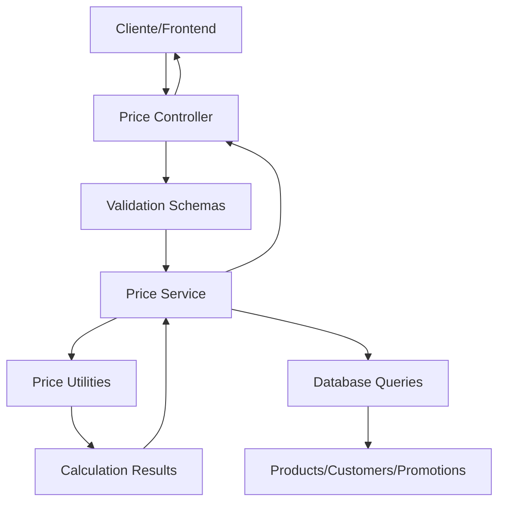

# Design Document

## Overview

O sistema de cálculo de preços no backend será implementado como um serviço dedicado que centraliza toda a lógica de precificação, incluindo cálculos de margem, markup, aplicação de descontos, impostos e promoções. A arquitetura seguirá os padrões já estabelecidos no projeto, utilizando a estrutura de serviços, controladores e schemas existente.

## Architecture

### Componentes Principais

1. **PriceService**: Serviço principal contendo toda a lógica de cálculo
2. **PriceController**: Controlador HTTP para exposição dos endpoints
3. **Price Schemas**: Validação e tipagem das requisições/respostas
4. **Price Routes**: Definição das rotas da API
5. **Price Utilities**: Funções auxiliares para cálculos específicos

### Fluxo de Dados



### Integração com Sistema Existente

O serviço de preços se integrará com:
- **Products Service**: Para obter dados de produtos e custos
- **Customers Service**: Para aplicar descontos personalizados
- **Presales Calculations**: Reutilizar utilitários existentes de cálculo
- **Database Schema**: Utilizar tabelas existentes de produtos, clientes e presales

## Components and Interfaces

### 1. Price Service Interface

```typescript
export interface PriceCalculationParams {
  productId: string;
  quantity: string;
  basePrice?: string; // Se não fornecido, usa preço do produto
  customerId?: string; // Para descontos personalizados
  applyPromotions?: boolean;
  includeTaxes?: boolean;
}

export interface PriceCalculationResult {
  productId: string;
  quantity: number;
  basePrice: number;
  subtotal: number;
  discounts: {
    customerDiscount: number;
    promotionalDiscount: number;
    totalDiscount: number;
  };
  taxes: {
    amount: number;
    rate: number;
  };
  finalPrice: number;
  margin: {
    amount: number;
    percentage: number;
  };
  markup: {
    amount: number;
    percentage: number;
  };
  calculationDetails: {
    cost: number;
    profit: number;
    timestamp: Date;
  };
}
```

### 2. Margin/Markup Calculation Interface

```typescript
export interface MarginMarkupParams {
  cost: string | number;
  sellingPrice: string | number;
}

export interface MarginMarkupResult {
  cost: number;
  sellingPrice: number;
  profit: number;
  margin: {
    amount: number;
    percentage: number;
  };
  markup: {
    amount: number;
    percentage: number;
  };
}
```

### 3. Price Suggestion Interface

```typescript
export interface PriceSuggestionParams {
  productId: string;
  targetMargin?: number; // Margem desejada em %
  targetMarkup?: number; // Markup desejado em %
  customerId?: string;
  quantity?: string;
}

export interface PriceSuggestionResult {
  productId: string;
  suggestedPrice: number;
  currentPrice: number;
  cost: number;
  projectedMargin: MarginMarkupResult['margin'];
  projectedMarkup: MarginMarkupResult['markup'];
  recommendations: string[];
}
```

## Data Models

### Estruturas de Dados Principais

```typescript
// Reutilizar estruturas existentes do presales
export interface PriceCalculationItem extends PreSaleItemCalculation {
  cost?: string | number; // Custo do produto
  taxRate?: string | number; // Taxa de imposto
}

// Estender tipos existentes
export interface EnhancedCalculationResult extends CalculationResult {
  margin: MarginMarkupResult['margin'];
  markup: MarginMarkupResult['markup'];
  taxes: { amount: number; rate: number };
}
```

### Database Schema Extensions

Não serão necessárias novas tabelas. O sistema utilizará:
- **products**: Para preços base e custos
- **customers**: Para descontos personalizados
- **presales/presale_items**: Para histórico de preços

## Error Handling

### Tipos de Erro

1. **Validation Errors**: Parâmetros inválidos (400)
2. **Not Found Errors**: Produto/cliente não encontrado (404)
3. **Business Logic Errors**: Regras de negócio violadas (422)
4. **Calculation Errors**: Erros matemáticos (500)

### Error Response Format

```typescript
export interface PriceCalculationError {
  code: string;
  message: string;
  details?: {
    field?: string;
    value?: any;
    constraint?: string;
  };
}
```

### Tratamento de Erros Específicos

- **Custo zero ou negativo**: Retornar erro de validação
- **Preço menor que custo**: Warning mas permitir cálculo
- **Margem/markup impossível**: Retornar sugestões alternativas
- **Produto sem custo cadastrado**: Usar preço base como fallback

## Testing Strategy

### 1. Unit Tests

**Price Utilities Tests**:
- Cálculos de margem e markup
- Conversões entre tipos de desconto
- Validações de entrada
- Casos extremos (valores zero, negativos)

**Price Service Tests**:
- Lógica de negócio completa
- Integração com dados de produtos
- Aplicação de descontos e impostos
- Cálculos de sugestão de preços

### 2. Integration Tests

**API Endpoint Tests**:
- Validação de schemas
- Respostas corretas para cenários válidos
- Tratamento de erros
- Performance dos cálculos

**Database Integration Tests**:
- Consultas de produtos e clientes
- Histórico de cálculos
- Transações e consistência

### 3. Performance Tests

**Load Testing**:
- Múltiplas requisições simultâneas
- Tempo de resposta < 2 segundos
- Rate limiting funcionando
- Memory usage estável

### 4. Business Logic Tests

**Calculation Accuracy**:
- Fórmulas matemáticas corretas
- Arredondamentos apropriados
- Cenários de negócio reais
- Comparação com cálculos manuais

## Implementation Approach

### Fase 1: Core Calculation Engine
- Implementar utilitários de cálculo de margem/markup
- Criar serviço base com cálculos simples
- Testes unitários para fórmulas

### Fase 2: API Endpoints
- Criar controlador e rotas
- Implementar validação de schemas
- Adicionar tratamento de erros
- Testes de integração

### Fase 3: Business Logic Enhancement
- Integrar com dados de produtos/clientes
- Implementar descontos e impostos
- Adicionar sugestões de preços
- Logging e auditoria

### Fase 4: Performance & Monitoring
- Implementar rate limiting
- Adicionar métricas de performance
- Otimizar consultas de banco
- Testes de carga

## Security Considerations

### Rate Limiting
- Máximo 100 requisições por minuto por IP
- Throttling progressivo para uso excessivo
- Whitelist para IPs internos

### Input Validation
- Sanitização de todos os parâmetros
- Validação de tipos e ranges
- Prevenção de injection attacks
- Limites de tamanho de payload

### Audit Trail
- Log de todos os cálculos realizados
- Rastreamento de usuário/sessão
- Timestamp e parâmetros utilizados
- Retenção de logs por 90 dias

## Performance Requirements

### Response Time
- Cálculos simples: < 200ms
- Cálculos complexos: < 2s
- Sugestões de preço: < 1s

### Throughput
- Suportar 1000 req/min em produção
- Degradação graceful sob carga
- Circuit breaker para dependências

### Caching Strategy
- Cache de dados de produtos (5 min TTL)
- Cache de cálculos frequentes (1 min TTL)
- Invalidação automática em updates